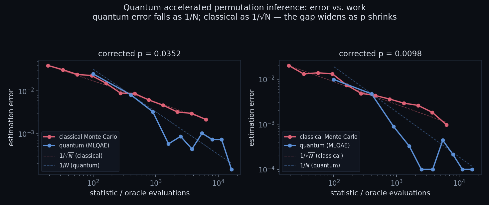
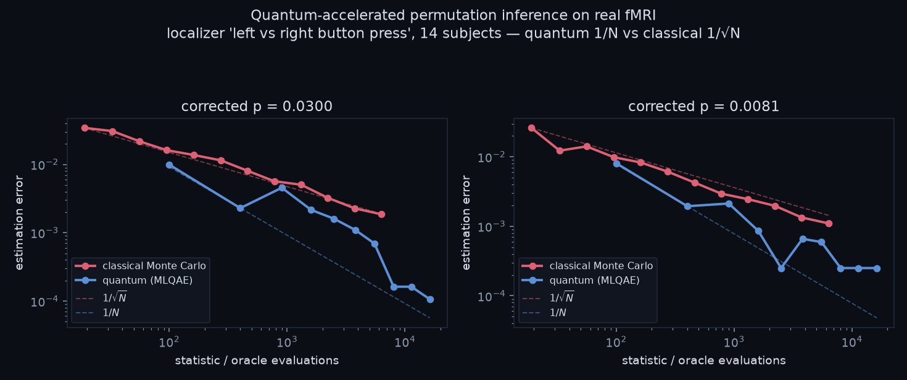

# qperm

Sign-flip permutation inference for group neuroimaging, with a proposed quantum
amplitude-estimation estimator offered alongside the usual classical permutation test.
You give it a subjects-by-voxels matrix (or NIfTI contrast maps), and it returns the
family-wise-error (FWER) corrected p-value. You can compute that p-value the classical way,
which runs on your data today, or with the quantum method, which by default emulates the
maximum-likelihood quantum amplitude estimation (MLQAE) estimator and can optionally run
real quantum circuits through Qiskit for small studies.

> **What the quantum option is, and is not.** Running on a classical computer, simulating
> the sign-flip null *is* the brute-force enumeration, so the quantum method here is not a
> faster or independent way to get a p-value. The classical method is the one you use for
> results. The quantum method is a faithful demonstration of the estimator: it reproduces
> the same corrected p and shows the `1/N` versus `1/sqrt(N)` query-complexity scaling, and
> `qperm_resources()` projects the query advantage at larger scales. The advantage is
> query complexity in simulation, verified against exact ground truth at small sample
> sizes, not a wall-clock speedup on today's hardware. This package extends the quantum
> statistical bootstrap framework of Chen, Ma and Zhong (2026); see
> [Relationship to prior work](#relationship-to-prior-work).

## Installation

```r
# install.packages("remotes")
remotes::install_github("kikijuki/qperm")
```

The core package needs only base R. Two optional features pull in extra pieces:

```r
install.packages("RNifti")                        # to read NIfTI contrast maps
install.packages("reticulate")                    # to run the real Qiskit backend
reticulate::py_install(c("qiskit"))               # Python side of the Qiskit backend
```

## Quick start

```r
library(qperm)
data(qae_demo)                # 10 subjects, 6 voxels, small enough to enumerate exactly

# Classical FWER-corrected permutation test (this is the usable analysis)
qperm_test(qae_demo, method = "classical")

# The quantum estimator, emulated, plus the scaling it would follow
fit <- qperm_test(qae_demo, method = "quantum", seed = 1)
fit
plot(fit)                     # quantum 1/N vs classical 1/sqrt(N)
```

## Two methods, one honest story

The `method = "classical"` path is a standard sign-flip permutation test. For one-sample or
paired designs the null relabeling is a sign flip on each subject, so the null is uniform
over the `2^n` sign vectors. qperm enumerates that null exactly when it has at most
`exact_max` members (default `2^20`) and samples it by Monte Carlo otherwise, then reports
the corrected p-value of the peak statistic and a per-voxel corrected p-map.

The `method = "quantum"` path reframes the same corrected p as a quantum amplitude and
estimates it with MLQAE. By default (`backend = "emulation"`) it runs a pure-R emulation of
that estimator; with `backend = "qiskit"` it builds and runs the actual circuits on a
statevector simulator, which is only tractable for small studies (one qubit per subject).
Either way it also attaches a `qperm_resources()` projection of the query cost against the
classical cost at your data's dimensions.

## What it computes

The per-voxel statistic is linear in the signs, `t_v(s) = (1/n) sum_i s_i y_iv`, which is
exactly what makes the quantum oracle a constant-weighted reversible adder. A
variance-normalized (t) statistic would break that linearity, so it is not used here.

Two family-wise statistics are available. The `stat = "max"` option uses the maximum over
voxels, giving peak-level FWER control. The `stat = "cluster"` option uses cluster extent,
the size of the largest suprathreshold connected component, which is the sharper
neuroimaging statistic; it needs voxel geometry, so pass `coords` (a voxels-by-d integer
coordinate matrix) or use NIfTI input.

## Examples

Classical corrected p-value and a per-voxel corrected map:

```r
fit <- qperm_test(Y, method = "classical", alternative = "two.sided")
fit$p_corrected      # corrected p of the peak
fit$p_map            # per-voxel corrected p-values
```

Cluster-extent test with explicit voxel coordinates:

```r
coords <- as.matrix(expand.grid(x = 1:8, y = 1:8))     # 64 voxels on a grid
qperm_test(Y, method = "classical", stat = "cluster",
           threshold = 2.3, coords = coords)
```

NIfTI contrast maps straight from an SPM or FSL first-level pipeline:

```r
img <- qperm_read_nifti(list.files("con_maps", pattern = "\\.nii", full.names = TRUE))
qperm_test(img, method = "classical", stat = "cluster", threshold = 2.3)
```

The quantum estimator as a real circuit run (small studies only):

```r
qperm_test(Y, method = "quantum", backend = "qiskit", shots = 200)
```

A resource projection at realistic neuroimaging scale:

```r
qperm_resources(n_subjects = 20, n_voxels = 50000, epsilon = 0.005)
#>   classical cost  : ~2e+09 oracle evaluations   O(eps^-2 * V)
#>   quantum cost    : ~3.5e+04 oracle evaluations   O(eps^-1 * sqrt(V))
```

## The idea

A typical fMRI study tests a hypothesis at tens or hundreds of thousands of voxels at once,
so controlling the family-wise error rate matters, and permutation testing is the
gold-standard, assumption-light way to do it (Nichols and Holmes, 2002; Winkler et al.,
2014). It is also expensive: resolving a probability of size `p` needs on the order of `1/p`
relabelings, so stricter significance costs more permutations. For one-sample and paired
designs the null is sign-flipping, so it is uniform over the sign vectors, and a single
layer of Hadamard gates prepares that uniform superposition for free, removing the
data-loading bottleneck that usually removes any quantum Monte Carlo advantage. Because the
statistic is linear in the signs, the oracle that marks "sign-flips whose statistic exceeds
the observed threshold" is a constant-weighted adder plus a comparator, with no data
register. The corrected p-value is then a tail probability over sign-flips, that is, an
amplitude, which MLQAE estimates with error falling as `1/N` rather than `1/sqrt(N)`
(Suzuki et al., 2020). The headline construction nests a Grover existence search over
voxels, `O(sqrt(V))`, inside amplitude estimation over permutations, `O(eps^-1)`, for a
compound cost `O(eps^-1 sqrt(V))` against the classical `O(eps^-2 V)`.



## Relationship to prior work

The central precedent is Chen, Ma and Zhong (2026), "Quantum statistical bootstrap"
(arXiv:2604.00951), which establishes the general framework: encode resamples in
superposition, evaluate an indicator onto a label qubit, read out the marked amplitude with
amplitude estimation, `O(eps^-1)` against classical `O(eps^-2)`. They explicitly name
quantum permutation tests as a future extension. qperm extends that framework rather than
inventing it: a data-loading-free sign-flip oracle that is cheaper than an index-encoded
bootstrap, the max-over-voxels and cluster-extent statistics that neuroimaging FWE control
actually needs, and the compound two-level algorithm that is quadratic in precision and
voxel count at the same time. Classical accelerators (Hinrichs et al., 2013;
Gutierrez-Barragan et al., 2017; Winkler et al., 2016) are complementary: they cut
wall-clock time today by exploiting spatial structure but leave the `1/sqrt(M)` Monte Carlo
rate unchanged, while amplitude estimation changes the rate and waits on hardware. The
"quantum permutation algorithm" of Yalcinkaya and Gedik (2017) is unrelated (it concerns
the parity of a cyclic permutation operator) and is noted only for disambiguation.

## Results from the original project

The method was verified against exact ground truth. On real fMRI, the Brainomics/Localizer
left-versus-right button-press contrast (14 subjects, 1000 voxels) enumerates all 16,384
sign-flips for an exact FWER-corrected `p = 0.00305`, which the quantum estimator reproduces
with error falling as `1/N`. Two extensions beyond the bootstrap framework's scalar
statistics were shown on benchmark data: a block-restricted PALM exchangeability null
(`p = 0.0039`) and a cluster-extent statistic (`p = 0.0020`). The compound algorithm's inner
Grover existence search peaks at `(pi/4) sqrt(V)` evaluations, and at fixed precision
`eps = 0.005` the compound cost at `V = 4096` is on the order of `10^4` evaluations against
roughly `10^8` classically.



## Honest limitations and open problems

The advantage is query complexity in exact simulation at small `n`, not a wall-clock
hardware speedup; small `n` is what lets the null be enumerated and the method verified. The
efficient reversible oracle for cluster connectivity is unsolved, so the Qiskit backend
supports the max statistic only and the emulation precomputes cluster oracles classically.
Nesting a probabilistic Grover existence search inside amplitude estimation, which needs a
clean phase oracle, requires exact or fixed-point amplification with a controlled error
budget, and that coherent nesting is the research crux, not a finished detail. A hardware
implementation waits on lower-noise devices and shallower-depth amplitude estimation
variants.

## Why the quantum method is a simulation, not a speedup

Worth stating plainly, since the package offers "quantum" as a method next to "classical".
On a classical machine there is no quantum coprocessor, so the emulation forms the sign-flip
null the same way the classical engine does, and it draws its MLQAE measurement counts from
the exact amplitude the classical engine already computed. It therefore cannot return a
p-value the classical path did not, and it is not faster. Its value is to demonstrate the
estimator and its scaling on your own data, and, through `qperm_resources()`, to project the
query advantage a real quantum device would give at scales where enumeration is infeasible.

## References

Brassard, G., Hoyer, P., Mosca, M., and Tapp, A. (2002). Quantum amplitude amplification and
estimation. Contemporary Mathematics, 305, 53-74. https://doi.org/10.1090/conm/305/05215

Chen, Y., Ma, P., and Zhong, W. (2026). Quantum statistical bootstrap. arXiv:2604.00951.
https://doi.org/10.48550/arXiv.2604.00951

Eklund, A., Nichols, T. E., and Knutsson, H. (2016). Cluster failure: why fMRI inferences
for spatial extent have inflated false-positive rates. PNAS, 113(28), 7900-7905.
https://doi.org/10.1073/pnas.1602413113

Hinrichs, C., Ithapu, V. K., Sun, Q., Johnson, S. C., and Singh, V. (2013). Speeding up
permutation testing in neuroimaging. NeurIPS, 26, 890-898.

Nichols, T. E., and Holmes, A. P. (2002). Nonparametric permutation tests for functional
neuroimaging. Human Brain Mapping, 15(1), 1-25. https://doi.org/10.1002/hbm.1058

Suzuki, Y., Uno, S., Raymond, R., Tanaka, T., Onodera, T., and Yamamoto, N. (2020).
Amplitude estimation without phase estimation. Quantum Information Processing, 19, 75.
https://doi.org/10.1007/s11128-019-2565-2

Winkler, A. M., Ridgway, G. R., Webster, M. A., Smith, S. M., and Nichols, T. E. (2014).
Permutation inference for the general linear model. NeuroImage, 92, 381-397.
https://doi.org/10.1016/j.neuroimage.2014.01.060

## Citation and license

See `CITATION.cff` for how to cite. Released under the MIT License (`LICENSE.md`). The
result figures are outputs of the original project; the Brainomics/Localizer data is due to
Pinel et al. (2007) and Papadopoulos Orfanos et al. (2017).

## Author

Kiju Lee. Department of Psychology, Yonsei University. Built at the
intersection of quantum computing and neuroimaging.
